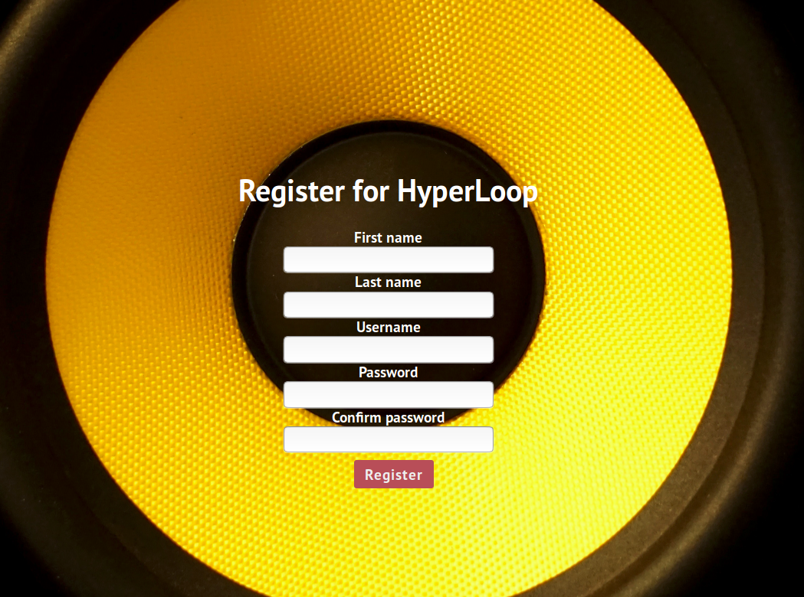

# HyperLoop

HyperLoop allows you to make quick drum loops easily and efficiently.

## Documentation
 The landing page gives a quick description of the app, leading up to the home page. Once on the home page, loops can be made by clicking the pads on screen. Controls are easy with volume and instrument select being located on the left side and a bpm slider/track adder being located at the bottom. The MidiSounds logo can also be clicked for full sound EQ settings. If logged in, loops can be saved and loaded with the click of a button at the bottom of the screen

## Live App 

- [Live App](https://hyperlooper.herokuapp.com/)

### Demo Login (no caps/spaces)

Username: demotest

Passord: demotester

## Screenshots
Landing Page:

Signup/Login Pages:

Main Page:

## Created Using

* HTML
* CSS
* Javascript
* React
* node.js
* Express
* Mongoose
* MongoDB
* Midi-sounds-react

## Author

* **Brian O'Carroll** 
* **bocarroll36@gmail.com**
